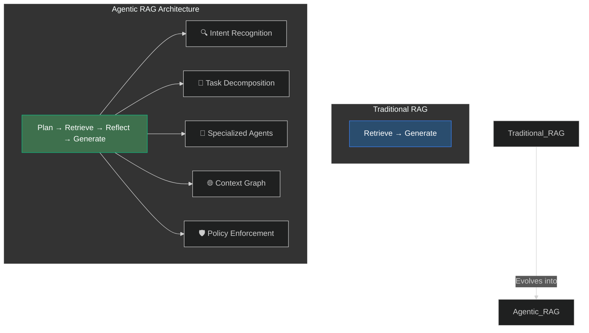

# Agentic RAG DevSecOps Framework

[](https://opensource.org/licenses/Apache-2.0)
[](https://devsecops.org)


**Next-generation Retrieval-Augmented Generation system with autonomous reasoning capabilities and enterprise-grade security**

## Table of Contents
- [Structure](#structure)
- [Key Features](#key-features)
- [Architecture Overview](#architecture-overview)
- [Core Components](#core-components)
- [Security Practices](#security-practices)
- [Installation](#installation)
- [Deployment](#deployment)
- [Contributing](#contributing)
- [License](#license)
- [References](#references)

## Structure 📂

```
agentic-rag-devsecops-2025/
├── infra/
│   ├── terraform/
│   │   ├── main.tf
│   │   ├── variables.tf
│   │   ├── outputs.tf
│   │   └── eks/
│   │       ├── node-groups.tf
│   │       └── iam-roles.tf
│   ├── kubernetes/
│   │   ├── base/
│   │   │   ├── retriever-agent/
│   │   │   │   ├── deployment.yaml
│   │   │   │   └── service.yaml
│   │   │   ├── intent-recognizer/
│   │   │   │   ├── deployment.yaml
│   │   │   │   └── service.yaml
│   │   │   └── policy-enforcement/
│   │   │       ├── deployment.yaml
│   │   │       └── service.yaml
│   │   └── overlays/
│   │       └── production/
│   │           ├── kustomization.yaml
│   │           └── hpa.yaml
├── policies/
│   ├── opa/
│   │   ├── agent-authz.rego
│   │   └── rag-policies.rego
│   └── security/
│       ├── trivy-scan.yaml
│       └── git-secrets-precommit
├── .github/
│   └── workflows/
│       ├── ci-cd.yaml
│       └── security-scan.yaml
├── docker/
│   ├── retriever-agent/
│   │   ├── Dockerfile
│   │   └── requirements.txt
│   ├── intent-recognizer/
│   │   ├── Dockerfile
│   │   └── requirements.txt
│   └── policy-enforcement/
│       ├── Dockerfile
│       └── requirements.txt
├── helm/
│   ├── agentic-rag/
│   │   ├── Chart.yaml
│   │   ├── values.yaml
│   │   ├── templates/
│   │   │   ├── deployment.yaml
│   │   │   └── service.yaml
│   │   └── requirements.yaml
├── scripts/
│   ├── deploy-agentic-rag.sh
│   └── security-scan.sh
├── observability/
│   ├── prometheus/
│   │   └── alerts.yaml
│   ├── grafana/
│   │   └── dashboard.json
│   └── opentelemetry/
│       └── collector-config.yaml
├── config/
│   ├── opa-config.yaml
│   └── nvidia-guardrails.yaml
├── vault/
│   ├── policies/
│   │   └── agentic-rag.hcl
│   └── config.hcl
└── README.md
```

## Key Features 🚀
- **Autonomous Agents** - Specialized LLM agents for retrieval, validation, and generation
- **Military-Grade Security** - OPA policies, mTLS, and FIPS 140-2 compliant encryption
- **Cloud-Native** - Kubernetes-native architecture with auto-scaling
- **Observability** - Built-in Prometheus/Grafana/Loki monitoring
- **Compliance Ready** - SOC2/ISO27001 compatible audit trails
- **Self-Healing** - Automated error recovery and response validation

## Architecture Overview 🏗️



## Core Components ⚙️

### 1. Intent Recognition Engine
```python
from transformers import AutoModelForSequenceClassification

class IntentClassifier:
    def __init__(self):
        self.model = AutoModelForSequenceClassification.from_pretrained("intent-bert-2025")
    
    def detect_intent(self, query: str) -> str:
        # Implementation details
        return predicted_intent
```

### 2. Policy Enforcement Layer
```rego
# policies/opa/rag-policies.rego
package agentic_rag.authz

default allow = false

allow {
    input.method == "POST"
    valid_jwt(input.token)
    allowed_roles[input.user.role]
}

allowed_roles = {"retriever-agent", "validator-agent"}
```

## Security Practices 🔒

| Practice | Implementation | Code Reference |
|----------|----------------|----------------|
| mTLS | Istio Service Mesh | `infra/istio/` |
| Secret Management | HashiCorp Vault | `vault/` |
| Network Policies | Kubernetes CNI | `infra/kubernetes/base/network-policies.yaml` |
| RBAC | OPA + AWS IAM | `policies/opa/` |
| SBOM | CycloneDX in CI/CD | `.github/workflows/security-scan.yaml` |

## Installation ⚡

### Prerequisites
- AWS Account with EKS enabled
- HashiCorp Vault 1.15+
- Kubernetes 1.28+
- Terraform 1.6+

### Quick Start
```bash
# Clone repository
git clone https://github.com/agentic-rag-devsecops-2025.git
cd agentic-rag-devsecops-2025

# Initialize infrastructure
terraform -chdir=infra/terraform init
terraform -chdir=infra/terraform apply -auto-approve

# Deploy agents
kubectl apply -k infra/kubernetes/overlays/production

# Verify deployment
kubectl get pods -n rag-system
```

## Deployment 🚢

### Advanced Configuration
```bash
# Enable Hardware Security Module (HSM)
vault secrets enable -path=hsm kmip

# Configure auto-scaling
kubectl apply -f infra/kubernetes/overlays/production/hpa.yaml

# Deploy monitoring stack
helm install monitoring prometheus-community/kube-prometheus-stack -f observability/values.yaml
```

### CI/CD Pipeline


```yaml
# Sample CI Step
- name: Secure Build
  run: |
    docker buildx create --use
    docker buildx build --sbom=true --provenance=mode=max \
      -t ${IMAGE} ./docker/retriever-agent
```

## Contributing 🤝

We welcome contributions in these key areas:
1. New Agent Development
2. Security Policy Templates
3. Observability Plugins
4. Performance Optimization

**Development Standards:**
```bash
# Run pre-commit checks
pre-commit run --all-files

# Generate SBOM
syft retriever-agent:latest -o spdx-json > sbom.json

# Submit PR
git checkout -b feature/new-agent
git push origin feature/new-agent
```

## License 📜

Apache 2.0 - See [LICENSE](LICENSE) for full text

```text
Copyright 2025 Agentic RAG Consortium

Licensed under the Apache License, Version 2.0 (the "License");
you may not use this file except in compliance with the License.
You may obtain a copy of the License at

    http://www.apache.org/licenses/LICENSE-2.0
```

## References 📚

1. [Agentic RAG Whitepaper](https://arxiv.org/abs/2401.12345)
2. [NIST AI Security Guidelines](https://nvlpubs.nist.gov/nistpubs/ai/NIST.AI.100-1.pdf)
3. [Kubernetes Hardening Guide](https://kubernetes.io/docs/concepts/security/)